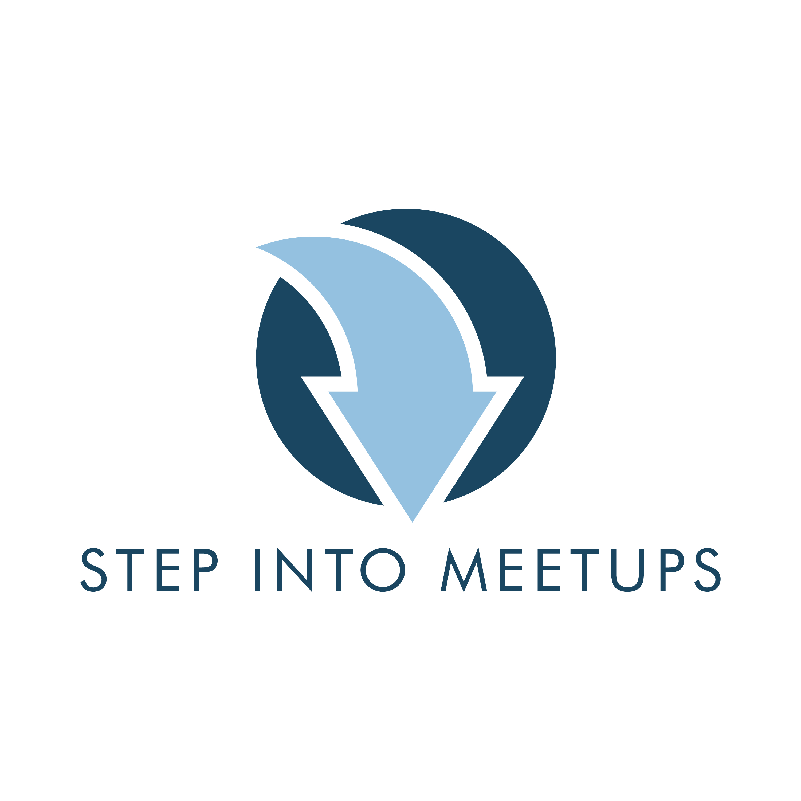

<!-- page_number: true -->
# Wildfly Swarm, avagy egy Spring Boot alternatíva 
## Holozsnyák Nándor Kristóf
### 2018.10.03.
<p align="center">

</p>

---
# Wildfly Swarm, avagy egy Spring Boot alternatíva

<p align="center">

</p>

###### Forrás: http://wildfly-swarm.io/

---
## Projekt létrehozása és futtatása Maven segítségével

* **BOM** - ```org.wildfly.swam:bom-all:_verziószám_```
* **frakciók** - Undertow HTTP szerver
* **wildfly-swarm-maven-plugin**
	* ```mvn wildfly-swarm:package```
	* ```mvn wildfly-swarm:run```
* ```java -jar artifact-swarm.jar```


---
## Projekt struktúra

Csomagolási módok:
* **WAR** - tipikus webes struktúra
* **JAR** - külön uberJar készítése szükséges

---
## Frakciók

* **Undertow** - HTTP szerver
* **JAX-RS** - REST
* **CDI** - Függőség injektáció
* **JPA** - Adatbázis kezelés
* **Swagger** - Végpont dokumentáció
* **Consul** - Szolgáltatás felderítés
* **Hystrix** - Biztosíték, kapcsoló, hibatűrés
* **Ribbon** - Kliens oldali Load-Balancing
* **Logging** - Tipikusan minden frakciónak része

---
## Konfigurációs állományok

Általánosságban minden frakció rendelkezik bizonyos konfigurációs beállításokkal.

* **fokozatok** - környezetenkénti konfigurációs állományok
  * ```-Sstage_neve``` - argumentummal való futtatás
* **project-defaults.yml** - project-*.yml

---
## Adatforrások

* **Automatikus felismerés**
  * H2
  * PostgreSQL
* **Konfiguráció**
* **persistence.xml**

---
## Tesztelés

* **Arquillian** - szolgáltatások tesztelésére
* **RestAssured** - végpontok tesztelésére
* **JMeter** - teljes folyamatok tesztelésére

---
## Micropofile integráció

Teljes mértékben képes a **Microprofile** szabvány alapján előírtakat hozni, egyedül a **microprofile** frakció behúzása szükséges.

<p align="center">

</p>

###### Forrás: http://wildfly-swarm.io/

---
# DEMO alkalmazás

A tárolóban található egy alkalmazás, amely 
pár szolgáltatást tartalmaz, egymással is kommunikálnak, illetve a külvilág felől is hívhatóak bizonyos funkciói.

---
# Kérdések

---
# Köszönöm a figyelmet!
### Holozsnyák Nándor Kristóf
##### nandor.holozsnyak@gmail.com
